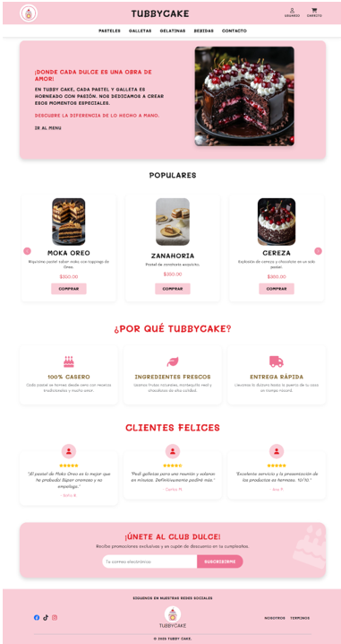
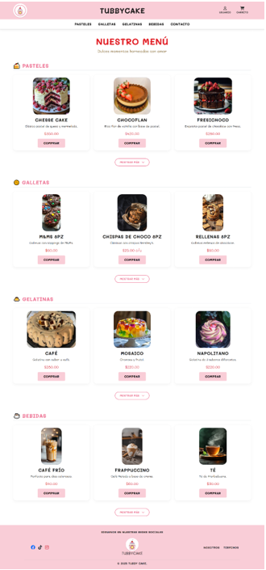
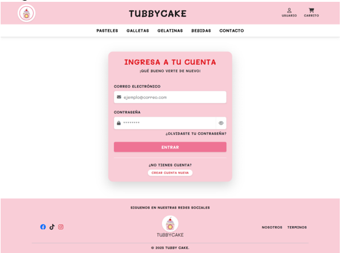
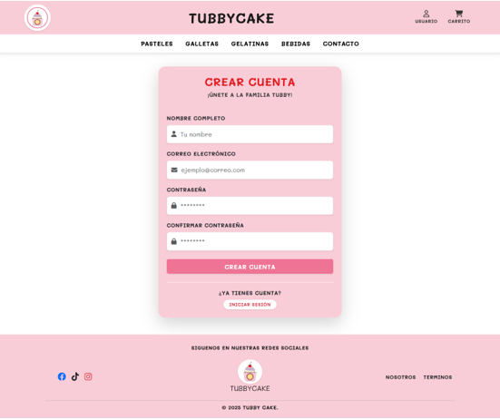
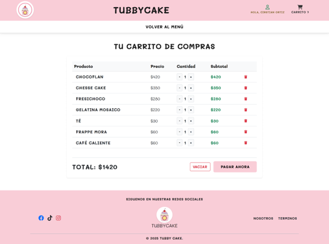
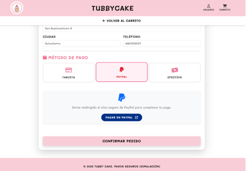
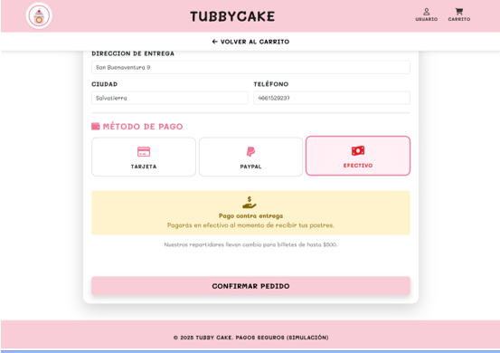
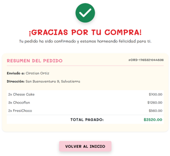

# 🧁 Tubby Cake – E-Commerce Web Simulation

<p align="center">
A Front-End E-Commerce simulation built with HTML, CSS and JavaScript.
</p>

<p align="center">
This project simulates an online dessert shop where users can browse products,
create an account, manage a shopping cart and complete a simulated purchase.
</p>

---

# 📖 About the Project

**Tubby Cake** is a simulated **E-Commerce website** created to promote a fictional bakery through digital platforms.

The goal of the project was to design a complete **online shopping experience** where users can:

- browse desserts
- add products to a cart
- create an account
- simulate a checkout process

The entire system works **without a traditional backend or database**.  
Instead, the application uses **JavaScript and the browser LocalStorage API** to simulate data persistence.

This approach demonstrates how a functional e-commerce workflow can be implemented using **pure front-end technologies**.

---

# 🚀 Main Features

🛒 Complete simulated purchase flow  
👤 User registration and login system  
🍰 Product catalog for desserts  
📦 Dynamic shopping cart management  
💳 Simulated checkout system  
💾 Data persistence using LocalStorage  
📱 Fully responsive design with Bootstrap  
✨ Custom UI elements such as toasts and modals

---

# 🧠 System Architecture

The website is structured as a **set of modular HTML pages** that guide the user through a typical online shopping journey.

## User Journey

| Page | Purpose |
|-----|------|
| **index.html** | Homepage with promotional content |
| **menu.html** | Displays the dessert catalog and allows adding products to the cart |
| **carrito.html** | Shows the cart summary and allows item management |
| **pago.html** | Handles the simulated checkout process |
| **gracias.html** | Displays order confirmation |
| **login.html** | Simulated user login |
| **registro.html** | New user registration |

---

# 🛒 Purchase Flow

The simulated purchase process follows this order:

```
Homepage → Product Menu → Cart → Checkout → Order Confirmation
```

Users can:

1. Browse desserts
2. Add items to the cart
3. Modify quantities
4. Select a payment method
5. Confirm their order

---

# ⚙️ Application Logic

The core logic of the system is implemented using **JavaScript and LocalStorage**.

LocalStorage allows data to persist even if the user refreshes the page or closes the browser.

### Data Serialization

Because LocalStorage only stores strings:

```
Save data:
localStorage.setItem(key, JSON.stringify(object))

Retrieve data:
JSON.parse(localStorage.getItem(key))
```

---

# 💾 LocalStorage Data Structure

The application uses several keys to simulate a database.

| Key | Type | Purpose |
|----|----|----|
| **tubbyCart** | Array | Stores selected products |
| **tubbyUser** | Object | Stores the logged-in user |
| **tubbyUsersDB** | Array | Simulates a database of registered users |
| **lastOrder** | Object | Stores the final order before clearing the cart |

---

# 🛍️ Shopping Cart Logic

### Adding Products
When a user clicks **Add to Cart**, the system checks if the item already exists.

- If it exists → increase quantity  
- If not → create a new object in the cart

### Cart Management

Inside **carrito.html**, users can:

- update product quantity
- remove products
- calculate subtotal and total price

The cart is updated dynamically using JavaScript.

---

# 💳 Checkout System

The checkout page allows users to choose between simulated payment methods:

- 💳 Credit Card
- 🅿 PayPal
- 💵 Cash

The interface dynamically updates depending on the selected method.

Example behavior:

- Credit card fields become **required**
- PayPal or cash **hide card inputs**

---

# 🎨 UI & User Experience

The project focuses on **modern UX design principles**.

### Responsive Design

The website was built using:

- **Bootstrap 5**
- **Flexbox**
- **Mobile-First design**

This allows the layout to adapt to:

- desktop
- tablet
- mobile devices

---

### Visual Identity

The project maintains a consistent visual style:

**Typography**

```
Mali Font
```

**Color Palette**

```
Salmon
Pink
Brown
```

These colors reinforce the **dessert shop branding**.

---

# ✨ Custom UI Components

Instead of using default browser alerts, custom components were implemented.

### Toast Notifications

Used to confirm actions such as:

```
Product added to cart
```

These notifications appear temporarily on the screen.

### Custom Modals

Used for important confirmations such as:

```
Remove item from cart
```

This improves the user experience compared to native `confirm()` dialogs.

---

# 🛠️ Technologies Used

### Frontend

- HTML5
- CSS3
- JavaScript

### Framework

- Bootstrap 5

### Data Storage

- Browser LocalStorage API

---

# 📂 Project Structure

```
Tubby-Cake
│
├── index.html
├── menu.html
├── carrito.html
├── pago.html
├── gracias.html
├── login.html
├── registro.html
│
├── resources
│   └── style.css
│
├── js
│   └── scripts.js
│
├── screenshots
│
└── README.md
```

---

# 📸 Website Preview

<p align="center">

<h3>Homepage</h3>


<h3>Menu</h3>


<h3>Login</h3>


<h3>Create Account</h3>


<h3>Shopping Cart</h3>


<h3>Payment Method (PayPal)</h3>


<h3>Payment Method (Cash)</h3>


<h3>Order Completed</h3>


</p>

# 🎯 Project Goal

The objective of this project was to demonstrate how a **complete e-commerce experience can be simulated using only front-end technologies**.

The system includes:

- product catalog
- user authentication simulation
- shopping cart management
- checkout flow
- order confirmation

All powered by **JavaScript logic and browser storage**.

---

# 👨‍💻 Author

**Cristian Gabriel Ortiz Uribe**

Web & Mobile Developer

GitHub  
https://github.com/Cristian-OrtizU

---

# 📄 License

This project was created for **educational and academic purposes**.
